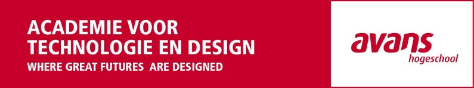

# cmd-avans

Mijn code opdrachten voor de opleiding CMD (Communicatie en Multimedia Design) op Avans.

## Jaar 1
Blok | Vak | Taal | Cijfer | Soort
--- | --- | --- | --- | ---
Blok 1 | BAWE | HTML & CSS | 9.0 | Opdracht
Blok 2 | ADWE | HTML & CSS | 9.0 | Opdracht
Blok 3 | BASC | Processing (Java) | 6.4 | Opdracht + Assessment
Blok 4 | ADSC | JS | 9.3 | Live programmeren

## Jaar 2
Blok | Vak | Taal | Cijfer | Soort
--- | --- | --- | --- | ---
Blok 5 | COMP | Arduino (C++) | 8.9 | Opdracht + Assessment
Blok 6 | MDEV | HTML, CSS & JS | 7.9 | Opdracht + Verantwoording video
Blok 7 | PROG | HTML, CSS & JS (p5.js) | 6.4 | Opdracht + Verantwoording video